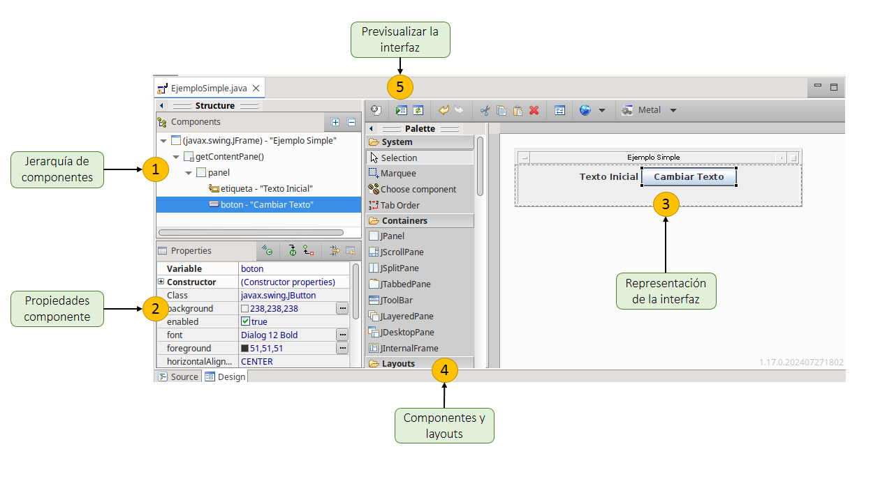
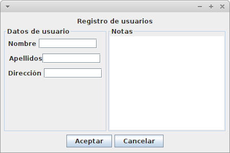
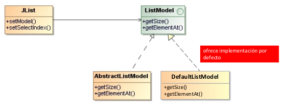
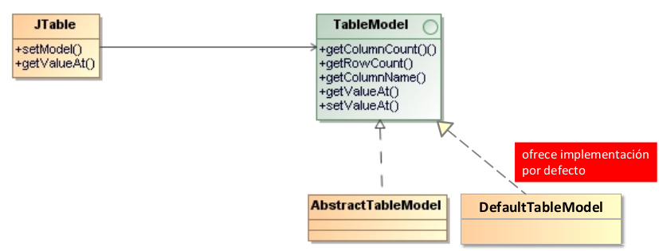
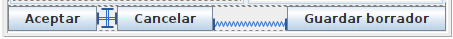

# Prácticas de Java/Swing

En estás prácticas se cubrirán los contenidos necesarios para desarrollar interfaces gráficas en Java/Swing. Se pretende cubrir los elementos fundamentales de Swing, pero que sean suficientes para construir desde interfaces muy simples hasta interfaces algo más avanzadas y además poder seguir descubriendo la librería por uno mismo.

El boletín sirve como un guion para los contenidos que veremos en clase, aunque no abarca todo el material que se discutirá. Además, incluye ejemplos y ejercicios prácticos para probar en el entorno de programación y poder modificarlos. Es recomendable seguir el ritmo de las prácticas, completar los ejercicios propuestos y experimentar por tu cuenta para sacar el máximo provecho de las sesiones.

## Java/Swing básico (Sesión 1)

`Java Swing` es una biblioteca gráfica que forma parte de la plataforma Java y se utiliza para crear aplicaciones con interfaces gráficas de usuario (GUI). Swing se encuentra dentro de la biblioteca más amplia conocida como Java Foundation Classes (JFC) y ofrece un conjunto de componentes que permiten diseñar ventanas, botones, menús, cuadros de diálogo, entre otros elementos de una interfaz visual interactiva. A diferencia de su predecesor AWT (Abstract Window Toolkit), Swing es más flexible y robusto, ya que no depende de los recursos nativos del sistema operativo, sino que ofrece una implementación completamente en Java, lo que permite una apariencia y comportamiento consistente en todas las plataformas. De hecho, es posible cambiar el *look & feel* de una aplicación Java e instalar temas propios.

Los elementos básicos de Swing incluyen componentes como JFrame (ventana principal), JPanel (paneles de contenedor), JButton (botones), y JLabel (etiquetas), que son fundamentales para construir la interfaz. Para comenzar a utilizar Swing, es importante familiarizarse con la organización jerárquica de estos componentes, ya que cada interfaz gráfica se construye añadiendo y organizando componentes dentro de un contenedor principal.

### Primera ventana

A continuación se muestra el ejemplo más simple de aplicación Java/Swing. Es una clase principal donde se construye un objeto `JFrame` para 

```java
package tds.swing;

import javax.swing.JFrame;

public class HolaMundoSwing {

    public static void main(String[] args) {
        // se crea la ventana
        JFrame miFrame = new JFrame("Hola Mundo con Swing");
        // se establecen las dimensiones de la ventana
        miFrame.setSize(300, 300);
        // la aplicación finaliza al cerrar la ventana
        miFrame.setDefaultCloseOperation(JFrame.EXIT_ON_CLOSE);
        // se hace visible la ventana
        miFrame.setVisible(true);
    }
}
```

Los métodos de la clase JFrame ofrecen funcionalidades para manejar 
la ventana, cambiando su aspecto estético o estableciendo su comportamiento
ante ciertos eventos.

#### Cuestiones

Explora los métodos de la clase `JFrame` y trata de realizar las siguientes tareas. Es buena idea ver la documentación de la clase o bien usar el autocompletado el editor para explorar los métodos disponibles.

- [ ] Cambiar la posición inicial
- [ ] Permitir que la ventana cambie de tamaño
- [ ] Añadir un icono personalizado a la ventana. Puedes buscar en sitios como [IconFinder](https://www.iconfinder.com/).

### Elementos básicos 

Una interfaz gráfica en Java Swing se compone de tres elementos clave que trabajan juntos para crear una experiencia interactiva: componentes, manejadores de disposición (layout managers) y eventos.

* ***Componentes*** contenidos en ***contenedores***: Los componentes son los elementos visuales que forman la interfaz, como botones, etiquetas, campos de texto, listas, etc. Estos componentes no se encuentran de forma independiente, sino que están organizados dentro de contenedores. Un contenedor puede ser una ventana principal (`JFrame`), un panel de organización (`JPanel`) o cualquier otro contenedor que agrupe componentes. Los contenedores sirven para organizar la interfaz y agrupar los componentes en diferentes secciones o áreas. 

  Es interesante observar que los `JPanel` además ser contenedores también son componentes y por tanto un contenedor puede contener otros contenedores (*patrón Composite*).

* ***Layout***: El layout de una interfaz gráfica especifica cómo se organizan y redimensionan los elementos de la interfaza. En Swing tenemos los `layout managers` que controlan cómo se distribuyen los componentes dentro de un contenedor. Existen diferentes tipos de layout managers, como `FlowLayout`, `BorderLayout` o `BoxLayout`. Dependiendo de cuál usemos los los componentes del contenedor se dispondrán de una otra forma.
Estos layout managers son esenciales para mantener una interfaz ordenada y adaptable, sin que sea necesario especificar manualmente las posiciones absolutas de los componentes.

* ***Eventos***: Los eventos son las interacciones que ocurren entre el usuario y la interfaz gráfica, como hacer clic en un botón, mover el ratón o escribir en un campo de texto. En Swing, el modelo de eventos permite que los componentes respondan a estas acciones mediante manejadores de eventos. Una manejador de eventos es un trozo de código que realiza una acción como respuesta a un evento. 

### Contenedores 

El siguiente ejemplo muestra cómo crear contenedores y anidarlos unos dentros de otros. La jerarquía de contenedores que se va a crear es la siguiente:

```
frame : JFrame
  + content pane (creado automáticamente por el JFrame)
    + contenedor1 : JPanel
      + contenedor2 : JPanel
      + contenedor3 : JPanel
```

En el código se utiliza el *layout* absoluto (establecido con `frame.setLayout(null)`) a modo de ejemplo, pero en general este layout no debe usarse porque los componentes no se redimensionan al cambiar el tamaño de la ventana.

```java
package tds.swing;
import javax.swing.*;
import java.awt.*;

public class ContenedoresSwing {
    public static void main(String[] args) {
        // Crear el marco principal (JFrame)
        JFrame frame = new JFrame("Ejemplo de Contenedores en Swing");
        frame.setSize(400, 400);
        frame.setDefaultCloseOperation(JFrame.EXIT_ON_CLOSE);
        // Usar layout absoluto para hacer pruebas (¡no usar en producción!)
        frame.setLayout(null);  
        // Equivalente a frame.getContentPane().setLayout(null)


        // Contenedor 1 (JPanel) - Panel principal
        JPanel contenedor1 = new JPanel();
        contenedor1.setBackground(Color.CYAN);
        contenedor1.setBounds(50, 50, 300, 300);
        contenedor1.setBorder(BorderFactory.createLineBorder(Color.BLACK, 2));  // Añadir borde

        // Contenedor 2 (JPanel) - Dentro del contenedor 1
        JPanel contenedor2 = new JPanel();
        contenedor2.setBackground(Color.ORANGE);
        contenedor2.setBounds(20, 20, 260, 120);
        contenedor2.setBorder(BorderFactory.createLineBorder(Color.RED, 2));  // Borde rojo

        // Contenedor 3 (JPanel) - También dentro del contenedor 1
        JPanel contenedor3 = new JPanel();
        contenedor3.setBackground(Color.GREEN);
        contenedor3.setBounds(20, 160, 260, 120);
        contenedor3.setBorder(BorderFactory.createLineBorder(Color.BLUE, 2));  // Borde azul

        // Añadir contenedores al contenedor principal
        contenedor1.setLayout(null);  // Layout absoluto dentro del panel
        contenedor1.add(contenedor2);
        contenedor1.add(contenedor3);

        // Añadir el contenedor 1 al marco principal
        frame.add(contenedor1);

        // Hacer visible el marco
        frame.setVisible(true);
    }
}
```

### Layouts básicos más simples

Los **layouts** en Java/Swing son esenciales porque permiten gestionar automáticamente la posición y el tamaño de los componentes dentro de un contenedor, como una ventana o un panel. Sin layouts, el programador tendría que calcular manualmente las posiciones y tamaños de cada componente, lo que sería poco práctico y llevaría a interfaces poco flexibles que no se adaptan a diferentes tamaños de pantalla o resoluciones.

A continuación se mencionan tres de los layouts más simples:

1. **FlowLayout**:
   - Distribuye los componentes en una fila, alineándolos de izquierda a derecha.
   - Cuando no hay más espacio en la fila, pasa a la siguiente.
   - Es el layout predeterminado para un `JPanel`.
   - Alineación sencilla y útil para interfaces simples.

2. **BorderLayout**:
   - Divide el contenedor en cinco regiones: **Norte, Sur, Este, Oeste y Centro**.
   - Cada región puede contener un solo componente.
   - Es útil cuando se quiere distribuir componentes en áreas específicas, como en una barra de herramientas, un panel principal, etc.
   - Es el layout predeterminado para un `JFrame`.
   - El componente (típicamente un panel) contenido en cada región se expande en todo el tamaño del panel.

3. **BoxLayout**:
   - Dispone los componentes en una única fila (horizontal) o columna (vertical).
   - Proporciona más control sobre el espacio entre componentes en comparación con el `FlowLayout`.
   - Respeta los *hints* de layout de los componentes (ver siguiente sección)


### Layout hints de los componentes

En Swing todos los componentes tienen unas propiedades especiales que sirven para dar pistas a los *layout managers* acerca de cómo deben mostrar los componentes. Estas propiedades son *pistas* y no todos los layout managers las respetan, pero es importante probarlas para saber qué layouts respetan qué propiedades y cuál es su efecto.

1. **`preferredSize`**: Define el tamaño recomendado para el componente. Indica al layout manager el tamaño que el componente debería tener bajo condiciones normales.

2. **`minimumSize`**: Establece el tamaño mínimo que el componente debe tener. Es el tamaño más pequeño que el componente puede reducirse.

3. **`maximumSize`**: Define el tamaño máximo que el componente puede tener. Es el tamaño más grande que el componente puede crecer.

4. **`alignment`**: Se refiere a la alineación del componente dentro de su contenedor. Se establece mediante `setAlignmentX(float alignmentX)` y `setAlignmentY(float alignmentY)`. El valor es un float entre 0.0 (izquierda o arriba) y 1.0 (derecha o abajo). El valor de 0.5 indica el centro.

No es trivial determinar qué combinación de valores es adecuada ya que es muy dependiente del *layout manager*. Es recomendable hacer pruebas con el editor de interfaces (WindowBuilder en este caso) y consultar la documentación correspondiente.

### Contenedores y layout simple

El siguiente ejemplo muestra cómo establecer el layout de una ventana simple.

```java
package tds.swing;

import java.awt.BorderLayout;
import java.awt.Dimension;
import java.awt.FlowLayout;

import javax.swing.JButton;
import javax.swing.JFrame;
import javax.swing.JLabel;
import javax.swing.JPanel;
import javax.swing.SwingUtilities;

public class EjemploSimple extends JFrame {

    public EjemploSimple() {
        // Configurar la ventana principal
        setTitle("Ejemplo Simple");
        setSize(300, 200);
        setDefaultCloseOperation(JFrame.EXIT_ON_CLOSE);
        setLayout(new BorderLayout());

        // Crear el panel para organizar los componentes
        JPanel panel = new JPanel();
        panel.setLayout(new FlowLayout());

        // Crear la etiqueta
        JLabel etiqueta = new JLabel("Una etiqueta");
        panel.add(etiqueta);

        // Crear el botón
        JButton boton = new JButton("Hace algo");
        panel.add(boton);

        // Añadir el panel a la ventana principal
        add(panel, BorderLayout.CENTER);
    }

    public static void main(String[] args) {
        SwingUtilities.invokeLater(() -> {
            EjemploSimple ventana = new EjemploSimple();
            ventana.setVisible(true);
        });
    }
}
```

#### Cuestiones

Trata de realizar las siguientes tareas sobre el código anterior.

- [ ] Cambia la alineación del botón y la etiqueta para que se "peguen a la derecha" (pista: pasa una constante como `FlowLayout.????` en el constructor).
- [ ] Añade un panel a la derecha del `content pane`. ¿Cómo puedes sabes si el panel se ha añadido correctamente?
- [ ] Cambia los *layout hints* de uno de los botones para descubrir cómo afecta a la disposición del botón.
- [ ] Investiga por qué es necesario usar `invokeLater` (para la siguiente clase).

### Componentes principales

Los paneles y los layouts sirven para organizar las diferentes zonas de una ventana. Dentro de estas zonas se incluirán componentes (*widgets*) 
con los que el usuario interactuará.

Algunos de los principales componentes son los siguientes.

- Textuales:
  - Campo de texto (JTextField) y Área de texto (JTextArea),
  - Etiquetas (JLabel)

- Controles:
  - Botones (JButton)
  - Menús (JMenu)

- Decoradores:
  - Bordes (Border) y Barras desplazamiento (JScrollPane)

- Selección
  - Listas (JList)
  - Combo (JComboBox)
  - Casillas marcado (JCheckBox)

Estos componentes se irán mostrando a medida que se construyen ejemplos.

### Creación de interfaces con WindowBuilder

WindowBuilder es una herramienta para la creación de interfaces gráficas de usuario (GUIs) mediante la tecnología Swing. Es un plugin para el entorno de desarrollo Eclipse que permite a los desarrolladores diseñar visualmente las interfaces de usuario arrastrando y soltando componentes en un editor gráfico, en lugar de escribir el código manualmente. A partir del diseño de la ventana, WindowBuilder genera el código Swing automáticamente (aunque es posible cambiar el código manualmente y WindowBuilder en la mayoría de las ocasiones es capaz de sincronizar adecuadamente).

En ocasiones las nuevas versiones pueden tener fallos, así que se puede probar con versiones anteriores de Eclipse donde se pueda instalar versiones anteriores de WindowBuilder.

En todo es caso importante señalar que ***es fundamental conocer los conceptos de Swing*** para poder tener éxito utilizando esta herramienta.
De hecho, en ocasiones peude ser necesario o más eficiente modificar a mano el código generado por la herramienta.

#### Instalación

1. Ir al menú `Help -> Eclipse Marketplace`
2. Buscar `WindowBuilder`
3. Confirmar la instalación

#### Uso del diseñador

Para acceder al editor de interfaces hay que hacer lo siguiente:

1. `File -> New -> Other -> WindowBuilder -> Swing Designer`
2. En este punto se ofrecen varios tipos de ventanas, como `JFrame` y `JPanel`. 
3. Para crear una ventana principal, se usará `JFrame`.

Una vez abierto el editor, tendrá el aspecto de la siguiente imagen. Para editar la interfaz se disponen de las siguientes herramientas:

1. La jerarquía de componentes muestran cómo se anidan los componentes y suele ser útil cuando la interfaz es grande para identificar exactamente a qué contenedor pertenece un componente.

2. Cuando se selecciona un componente, sus propiedades aparecen automáticamente y se pueden editar.

3. Se pueden arrastrar componentes a la zona de la representación de la interfaz (3), aunque en ocasiones es mejor arrastrar los componentes a la jerarquía de componentes para evitar ambigüedades (ej., no poder distinguir visualmente en qué zona se está colocando un componente).

4. Los componentes disponibles se clasifican en grupos: contenedores, layouts y componentes (hay otros grupos, pero estos son los principales).

5. Se puede probar la interfaz bien ejecuando el programa o bien con el botón de previsualización.



#### Algunos trucos

* Para abrir un fichero `.java` que implementa una interfaz gráfica a veces es necesario abrirlo explícitamente `Botón derecho sobre el fichero -> Open with... -> WindowBuilder Editor`. Luego hay que prestar atención a que el editor que se abre tiene dos pestañas `Source` y `Design`.

* No olvidar nombrar los componentes que se han arrastrado (es muy tentador dejar `panel_1`, `panel_2`, etc.).

* Es importante fijarse en el árbol de componentes que aparece a la izquierda, ya que refleja de manera clara la organización real de los componentes.

* En algunas versiones de WindowBuilder las propiedades que se muestran para editar no son todas las disponibles. WindowBuilder solo muestra por defecto las básicas. Para que se muestren todas las propiedades: `Botón derecho en la paleta de propiedades -> Show advanced properties`.

#### Ejercicio

Construir la siguiente ventana para el registro de un usuario:



Debes combinar los layouts vistos BorderLayout, FlowLayout y BoxLayout para conseguir el efecto deseado. 

## Componentes y layouts (Sesión 2)

En esta sesión de describirán los componentes básicos más utilizados (sin entrar en detalle de sus características), algunos componentes más avanzados como otros tipos de paneles y listas de datos. También se presentarán más tipos de layouts.

**Ejercicio**. Se recomienda que a medida que se van describiendo los componentes se vayan probando utilizando WindowBuilder. Para cada nuevo componente, búscalo en WindowBuilder, introducelo en una ventana de prueba y comprueba cómo se comporta y alguna de sus propiedades. También, comprueba el código generado por WindowBuilder.

### Componentes básicos

#### JLabel

Sirve para mostrar un texto o una imagen.

```java
JLabel lblNombre = new JLabel("Nombre: ");
lblNombre.setFont(new Font("Tahoma", Font.BOLD, 14));
```

#### JTextField

Sirve para introducir un texto simple. Típicamente usado en formularios.

```java
JTextField tfNombre = new JTextField();
tfNombre.setText("Sin nombre");
tfNombre.setColumns(20);

// Usar tfNombre.getText() para obtener el texto
```

#### JTextArea

Es una caja de texto multilínea. Por ejemplo, puede servir para un campo de "Observaciones" en un formulario. No permite formatear el texto (para ello se usa JTextPane o JEditorPane pero son más complicados).

```java
JTextArea txtrObservaciones = new JTextArea();
txtrObservaciones.setRows(12);
txtrObservaciones.setColumns(50);
txtrObservaciones.setLineWrap(true);      // partir líneas
txtrObservaciones.setWrapStyleWord(true); // partir por palabras
```

#### JCheckBox

Muestra un botón que tiene dos estados: seleccionado ( :heavy_check_mark:) o no seleccionado (:black_square_button:).

```java
JCheckBox esEstudiante = new JCheckBox("¿Es estudiante?");
// Comprobar con esEstudiante.isSelected()
```

#### JButton

Explicar cómo poner un icono


#### JRadioButton

Es un grupo de botones que tienen la característica de que usuario sólo puede marcar sólo uno a la vez.

Un `JRadioButton` debe formar parte de un `ButtonGroup` para funcionar correctamente. Los `JRadioButton` del mismo grupo son exclusivos.

```java
ButtonGroup grupo = new ButtonGroup();

JRadioButton pequeño = new JRadioButton("Pequeño",true);
grupo.add(pequeño);

JRadioButton mediano = new JRadioButton("Mediano",false);
grupo.add(mediano);

if (grupo.getSelection() == mediano {...}

```

#### JComboBox

Permite seleccionar una opción dentro de una lista desplegable

```java
// Crear un array con las opciones del combo
String[] dias = {"lunes", "martes", "miercoles", "jueves", "viernes", "sábado", "domingo"};
        
// Crear el combo, pasando el array como parámetro
JComboBox<String> combo = new JComboBox<String>(dias);
        
// Para seleccionar por código una opción, usar setSelectIndex(<posicion>)
combo.setSelectedIndex(2);

// Añadir el combo al panel donde se quiera mostrar
JPanel ejemploComboBox = new JPanel(new GridLayout(1,2,10,0));
ejemploComboBox.add(new JLabel("Selecciona un día"));
ejemploComboBox.add(combo);
        
// Para saber qué entrada está seleccionada, 
// usar getSelectedItem o getSelectedIndex
String valorSeleccionado  = (String)combo.getSelectedItem();
int    indiceSeleccionado = combo.getSelectedIndex();
```

### Paneles y decoradores

#### Bordes

En Java Swing, los bordes son elementos decorativos que rodean los componentes, como botones, paneles o etiquetas. Un borde se utiliza para resaltar o darle estilo a los componentes visuales. La clase `javax.swing.BorderFactory` se utiliza para crear los bordes. 

Los componentes tienen la propiedad `setBorder` para asignarles un borde. Normalmente, el borde se pondrá en `JPanel`.

Hay muchos tipos de bordes, por simplicidad nos centramos en dos:

- **TitledBorder (Borde con título)**. Este borde tiene un título, lo que es útil para etiquetar una sección de la GUI.

```java
// Ejemplo de TitledBorder
JPanel panel = new JPanel();
panel.setBorder(BorderFactory.createTitledBorder("Datos personales"));
```


- **EmptyBorder (Borde vacío)**. Este tipo de borde no dibuja nada visible, pero deja un espacio alrededor del componente, lo cual es útil para agregar márgenes alrededor de un componente.

```java
// Ejemplo de EmptyBorder
// Se crea un espacio vacío de 10 píxeles alrededor del panel.
JPanel panel = new JPanel();
panel.setBorder(BorderFactory.createEmptyBorder(10, 10, 10, 10));
```

#### JScrollPane

Un `JScrollPane` proporciona una vista sobre otro componente al que le añade barras de desplazamiento cuando tal componente se hace más grande que el espacio asignado.

Por ejemplo, si se crea una ventana con un area de texto, cuando se llena el área de texto no aparece ninguna barra de desplazamiento. Es es el comportamiento por defecto de la mayoría de los componentes (incluyendo `JList`). 

```java
JFrame miFrame = new JFrame("Probar JScrollPane");
miFrame.setSize(200, 200);
miFrame.setDefaultCloseOperation(JFrame.EXIT_ON_CLOSE);

JTextArea textArea = new JTextArea();
miFrame.add(textArea, BorderLayout.CENTER);

miFrame.setVisible(true);   
```

La alternativa es "envolver" el componente afectado (un `JTextArea` en este caso) con un componente de tipo `JScrollBar`. La zona donde se coloca el componente se denomina "viewport view". También es posible asignatura una cabecera ("column header view").

```java
JFrame miFrame = new JFrame("Probar JScrollPane");
miFrame.setSize(200, 200);
miFrame.setDefaultCloseOperation(JFrame.EXIT_ON_CLOSE);

JScrollPane scrollPane = new JScrollPane();
miFrame.getContentPane().add(scrollPane, BorderLayout.CENTER);

JTextArea textArea = new JTextArea();
scrollPane.setViewportView(textArea);

JLabel lblNewLabel = new JLabel("Observaciones");
scrollPane.setColumnHeaderView(lblNewLabel);

miFrame.setVisible(true);  
```

#### JSplitPane

Este tipo de contenedor permite dividir un área de visualización en dos componentes (paneles), con una barra de división ajustable. Cuando se mueve la barra, los componentes se redimensionan.

La propiedad `setOrientation` indica si la división es horizontal (`JSplitPane.HORIZONTAL_SPLIT`) o vertical (`JSplitPane.VERTICAL_SPLIT`).

```java
// Crear la ventana (JFrame)
JFrame frame = new JFrame("Ejemplo de JSplitPane");
frame.setDefaultCloseOperation(JFrame.EXIT_ON_CLOSE);
frame.setSize(500, 300);

// Crear dos componentes que estarán en los lados del JSplitPane
JTextArea textArea = new JTextArea("Área de Texto");
JLabel label = new JLabel("Etiqueta en el segundo panel");

// Crear el JSplitPane
JSplitPane splitPane = new JSplitPane(JSplitPane.HORIZONTAL_SPLIT, new JScrollPane(textArea), label);

// Configurar la posición inicial de la barra divisoria 
// en número de pixeles desde la izquierda
splitPane.setDividerLocation(100); 

// Hacer que la barra divisoria sea expansible con un botón
splitPane.setOneTouchExpandable(true);

// Añadir el JSplitPane a la ventana
frame.add(splitPane);

// Hacer visible la ventana
frame.setVisible(true);
```

#### JTabbedPane

Es un tipo de contenedor que permite organizar los componentes que contiene como pestañas. Típicamente se utiliza para organizar varias pantallas.

```java
// Cada uno de los paneles que forman las pestañas
JPanel pestania1 = new JPanel();
JPanel pestania2 = new JPanel();
JPanel pestania3 = new JPanel();

// Creamos un contenedor de tipo JTabbedPane (no JPanel). 
JTabbedPane pestanias = new JTabbedPane();

// Añadimos los paneles al contenedor con el método addTab(<título>,<panel>)
pestanias.addTab("Pestaña 1", pestania1);
pestanias.addTab("Pestaña 2", pestania2);
// El método addTab también permite asociar un icono y ayuda contextual a la pestaña
pestanias.addTab("Pestaña 3", new ImageIcon("Image3.gif"), pestania3, "Esta pestaña hace cosas");
```

### Listas y tablas

#### JList

En Java Swing, el componente `JList` se utiliza para mostrar una lista de elementos que pueden ser seleccionados por el usuario. En un `JList` no se pueden editar los elementos (aunque se pueden añadir y eliminar elementos), pero es muy útil cuando se necesita presentar una lista de opciones de manera simple y clara.

##### JList y el modelo de datos

Uno de los conceptos clave para trabajar con un JList es el modelo de datos. El modelo de datos establece cuáles son los elementos que que se muestran en la lista. La siguiente imagen muestra las clases relacionadas.



- Interfaz `ListModel`. Representa la fuente de datos subyacente de un JList. Define cómo se accede y gestiona la colección de datos. Además incluye otros métodos (no mostrados) para instalar *oyentes* sobre cambios en la lista.

- Clase `DefaultListModel`. Es una implementación por defecto que permite añadir objetos al modelo con `addElement` y `JList` muestra el valor obtenido invocando a `toString()`.

- Clase abstracta `AbstractListModel`. Es una implementación parcial ya implementa la gestión de los oyentes.

##### Un JList con un modelo de datos por defecto

A continuación se muestra un ejemplo de uso de JList. En este caso se muestran objetos de tipo `Persona`. Es importante observar que tanto `JList<T>` como `DefaultListModel<T>` están parametrizados con el tipo de los objetos que contienen.


```java
package tds.swing.componentes;
import javax.swing.*;
import java.awt.*;

public class EjemploJList {

    public static class Persona {
      private final String nombre;
      private final String apellidos;
      public Persona(String nombre, String apellidos) {
        this.nombre = nombre;
        this.apellidos = apellidos;
      }
      
      @Override
      public String toString() {
        return nombre + " " + apellidos;
      }
    }
	
    public static void main(String[] args) {
        // Crear un JFrame
        JFrame frame = new JFrame("Ejemplo de JList con DefaultListModel");
        frame.setDefaultCloseOperation(JFrame.EXIT_ON_CLOSE);
        frame.setSize(300, 200);

        // Crear un modelo de lista y agregar elementos
        DefaultListModel<Persona> modelo = new DefaultListModel<>();
        modelo.addElement(new Persona("Jose", "López"));
        modelo.addElement(new Persona("Ana", "Jover"));
        modelo.addElement(new Persona("María", "Sánchez"));

        // Crear el JList basado en el modelo
        JList<Persona> lista = new JList<>(modelo);

        // Agregar la lista al frame
        frame.add(new JScrollPane(lista), BorderLayout.CENTER);
        frame.setVisible(true);
    }
}
```

##### JList con un modelo de datos propio

A modeo de ejemplo se muestra una implementación simple de un `ListModel` propio. Una implementación más avanzada podría requerir añadir elementos dinámicamente.

```java
package tds.swing.componentes;
import javax.swing.*;
import java.awt.*;

public class JListExample {

    public static class Persona {
      private final String nombre;
      private final String apellidos;
      public Persona(String nombre, String apellidos) {
        this.nombre = nombre;
        this.apellidos = apellidos;
      }
      
      @Override
      public String toString() {
        return nombre + " " + apellidos;
      }
    }
	
    public static class PersonasListModel extends AbstractListModel<Persona> {

      private static Persona[] personas = new Persona[] {
          new Persona("Jose", "López"),
          new Persona("Ana", "Jover"),
          new Persona("María", "Sánchez")
      };
            
      @Override
      public int getSize() {
        return personas.length;
      }

      @Override
      public Persona getElementAt(int index) {
        return personas[index];
      }
      
    }
	
    public static void main(String[] args) {
        // Crear un JFrame
        JFrame frame = new JFrame("Ejemplo de JList con DefaultListModel");
        frame.setDefaultCloseOperation(JFrame.EXIT_ON_CLOSE);
        frame.setSize(300, 200);

        // Crear el JList basado en el modelo
        JList<Persona> lista = new JList<>(new PersonasListModel());

        // Agregar la lista al frame
        frame.add(new JScrollPane(lista), BorderLayout.CENTER);
        frame.setVisible(true);
    }
}
```

#### JTable

Este componente muestra una tabla organizada en filas y columnas. Es muy útil para mostrar un conjunto de registros, como una tabla de una base de datos. También es posible editar los datos en la propia tabla.

Al igual que sucedía con `JList`, los datos de un `JTable` son proporcionados por un "modelo". En este caso, la jerarquía de clases correspondiente es la siguiente:



A continuación se muestra un ejemplo de uso:

```java
package tds.swing.componentes;

import java.awt.EventQueue;
import java.util.ArrayList;
import java.util.List;

import javax.swing.JFrame;
import javax.swing.JScrollPane;
import javax.swing.JTable;
import javax.swing.table.AbstractTableModel;

import java.awt.BorderLayout;
import java.awt.Dimension;

public class JTableExample {

	private JFrame frame;
	private JTable table;

	/**
	 * Launch the application.
	 */
	public static void main(String[] args) {
		EventQueue.invokeLater(new Runnable() {
			public void run() {
				try {
					JTableExample window = new JTableExample();
					window.frame.setVisible(true);
				} catch (Exception e) {
					e.printStackTrace();
				}
			}
		});
	}

	/**
	 * Create the application.
	 */
	public JTableExample() {
		initialize();
	}

	/**
	 * Initialize the contents of the frame.
	 */
	private void initialize() {
		frame = new JFrame();
		frame.setBounds(100, 100, 450, 300);
		frame.setDefaultCloseOperation(JFrame.EXIT_ON_CLOSE);
		
		ModeloTabla modelo = new ModeloTabla();
		table = new JTable(modelo);
        table.setPreferredScrollableViewportSize(new Dimension(500, 70));
        table.setFillsViewportHeight(true);

		frame.getContentPane().add(new JScrollPane(table), BorderLayout.CENTER);
	}
	
	public static class Alumno {
		private String nombre;
		private String apellidos;
		private int nota;
		private boolean aprobado;
		
		public Alumno(String nombre, String apellidos, int nota, boolean aprobado) {
			this.nombre = nombre;
			this.apellidos = apellidos;
			this.nota = nota;
			this.aprobado = aprobado;
		}
	}
	
	private static class ModeloTabla extends AbstractTableModel {

		private static final String[] COLUMNAS = new String[] { "Nombre", "Nota", "Aprobado" };
		
		private List<Alumno> alumnos = new ArrayList<>();
		
		public ModeloTabla() {
			alumnos.add(new Alumno("Pepe", "López", 4, true));
		}
		
		@Override
		public int getRowCount() {
			return alumnos.size();
		}
		
		@Override
		public String getColumnName(int column) {
			return COLUMNAS[column];
		}

		@Override
		public int getColumnCount() {
			return COLUMNAS.length;
		}

		@Override
		public Object getValueAt(int rowIndex, int columnIndex) {
			Alumno alumno = alumnos.get(rowIndex);
			switch (columnIndex) {
			case 0: 
				return alumno.nombre + " " + alumno.apellidos;
			case 1:
				return alumno.nota;
			case 2:
				return alumno.aprobado;
			default:
				throw new IllegalArgumentException("Unexpected value: " + columnIndex);
			}
		}
		
		@Override
		public boolean isCellEditable(int rowIndex, int columnIndex) {
			return columnIndex == 2;
		}
		
		@Override
		public void setValueAt(Object aValue, int rowIndex, int columnIndex) {
			Alumno alumno = alumnos.get(rowIndex);
			if (columnIndex == 2) {
				alumno.aprobado = (Boolean) aValue;
				
				fireTableCellUpdated(rowIndex, columnIndex);
			}
		}
		
		@Override
		public Class<?> getColumnClass(int columnIndex) {
			switch (columnIndex) {
			case 0: 
				return String.class;
			case 1:
				return Integer.class;
			case 2:
				return Boolean.class;
			default:
				throw new IllegalArgumentException("Unexpected value: " + columnIndex);
			}
		}
		
	}

}
```

#### JTree

Es similar a JTable pero muestra un árbol.


### Más tipos de layouts

#### GridLayout

Un `GridLayout` organiza los componentes dentro de un contenedor en una cuadrícula bidimensional, dividida en filas y columnas. Sus características son:

* Distribución uniforme: Todos los componentes tienen el mismo tamaño, sin importar su contenido. 

* Orden de colocación: Los componentes se agregan de arriba hacia abajo y de izquierda a derecha Es decir, que conforme se añaden al contenedor, van apareciendo organizados en la rejilla.

* Redimensión: Si el contenedor cambia de tamaño, los componentes dentro de la cuadrícula se redimensionan para ocupar el espacio disponible.
  
#### Componentes de relleno y Box Layout

Para poner espacio entre los componentes de un Box layout se utilizan "fillers". La clase `Box` define la clase anidada `Box.Filler` que es un componente invisible cuyo objetivo es crear un espacio entre otros componentes.

En *WindowBuilder*, los componentes de relleno se encuentran en la pestaña `Struts & Springs`. En particular, utilizaremos estos dos:

- `RigidArea`. Se utiliza para poner un espacio fijo entre dos componentes.
- `Glue`. Para indicar dónde debe ir el espacio sobrante.

Por ejemplo, la siguiente imagen muestra cómo organizar el espacio entre botones relacionados. Entre `Aceptar` y `Cancelar` se ha puesto un `RigidArea` y luego se utiliza un `Horizontal Glue` para que `Guardar borrador` se pegue a la derecha debido a que el componente glue toma todo el espacio restante.



El código asociado es el siguiente:

```java
JPanel panel = new JPanel();
panel.setLayout(new BoxLayout(panel, BoxLayout.X_AXIS));

JButton btnAceptar = new JButton("Aceptar");
panel.add(btnAceptar);

Component rigidArea = Box.createRigidArea(new Dimension(20, 20));
panel.add(rigidArea);

JButton btnCancelar = new JButton("Cancelar");
panel.add(btnbtnCancelarNewButton_2);

Component horizontalGlue = Box.createHorizontalGlue();
panel.add(horizontalGlue);

JButton btnGuardar = new JButton("Guardar borrador");
panel.add(btnGuardar);
```

Ver https://docs.oracle.com/javase/tutorial/uiswing/layout/box.html#filler para más información.

#### GridBagLayout

Este layout coloca los componentes en una cuadrícula (*grid*), pero ofrece mucha flexibilidad porque un componente puede ocupar más de una celda. Además ofrece controles sobre el tamaño de los componentes (ej., este componente debe llenar el espacio disponible) y su alineación.

Para controlar cómo se comporta cada componente dentro de la cuadrícula, se utiliza la clase `GridBagConstraints` que incluye propiedades para gestionar cómo se dispone el componente.

Se recomienda utilizar WindowBuilder para utilizar este layout ya que el código generado pronto empieza ser bastante complejo.