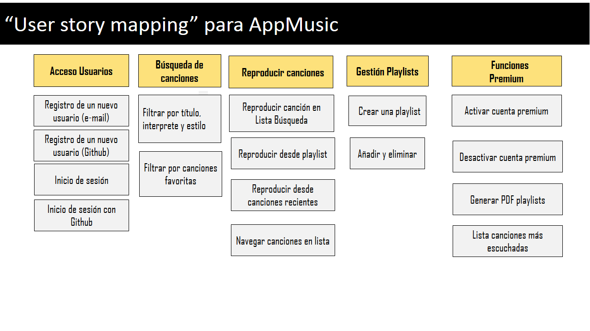

# Historias de Usuario - Aplicación de Música

A continuación se muestra una propuesta de "User Story Mapping" para el caso de estudio AppMusic. En la parte de arriba (en amarillo) se muestran las metas u objetivos principales del usuario, que luego se descomponen en Historias de Usuario.

A continuación se detallan algunas de las Historias de Usuario, tal y como se discutieron en clase, con el objetivo de que sirvan de guía para crear otras similares en el proyecto de la asignatura.

## Acceso usuarios

### Registro de un nuevo usuario (con correo electrónico)

**COMO** usuario no registrado  
**QUIERO** registrarme con mi correo electrónico  
**PARA** poder utilizar la aplicación (reproducir canciones)

#### Criterios de aceptación:

1. **Pantalla de Registro**  
   - **Dado que** estoy en la pantalla de inicio  
   - **Cuando** se clica en “Registrar con correo electrónico”  
   - **Entonces** se muestra la pantalla de registro donde se piden los siguientes datos: Nombre, Apellidos, DNI, Correo Electrónico, etc.

2. **Correo Electrónico Inválido**  
   - **Dado que** estoy en la pantalla de registro 
   - **Cuando** escribo un correo electrónico inválido  
   - **Entonces** tiene que mostrarse un error y no permitir el registro.

3. **Datos Correctos**  
   - **Dado que** estoy en la pantalla de registro (o me estoy registrando)  
   - **Cuando** todos los datos son correctos  
   - **Entonces** se tiene que registrar al usuario y enviar un correo electrónico de confirmación.

### Registro con GitHub
En clase se habló de utilizar Google como pasarela de autenticación.

**COMO** usuario no registrado  
**QUIERO** registrarme con mi cuenta de GitHub  
**PARA** poder utilizar la aplicación y que el login sea muy rápido

---

## Reproducción de Canciones

### Reproducción desde lista de búsqueda

**COMO** usuario con sesión iniciada 
**QUIERO** reproducir una canción o pausarla  
**PARA** poder escucharla en mi dispositivo

#### Criterios de aceptación:
1. **Reproducir Canción**  
   - **Dado que** he encontrado una canción que quiero reproducir  
   - **Cuando** la selecciono  
   - **Entonces** comienza la reproducción inmediatamente.

2. **Pausar Canción**  
   - **Dado que** se está reproduciendo una canción  
   - **Cuando** pulso el botón “pausa” 
   - **Entonces** se detiene la reproducción.

3. **Reanudar Canción**  
   - **Dado que** una canción está en pausa  
   - **Cuando** pulso el botón “play”  
   - **Entonces** continúa la reproducción.

---

## Playlists

### Crear una playlist

**COMO** usuario con sesión iniciada  
**QUIERO** crear una playlist  
**PARA** reproducirla y tenerla organizada con otras canciones similares

#### Criterios de aceptación:

- **Dado que** tengo la sesión iniciada (y en cualquier sitio de la aplicación)  
- **Cuando** pulso el botón “Crear playlist”  
- **Entonces** se crea una playlist vacía y se pide el nombre de la playlist.

### Crear Playlist con Recomendación
Esta historia de usuario no aparece en los requisitos, pero se incluye ya que fue discutido en clase.

**COMO** usuario con sesión iniciada  
**QUIERO** crear una playlist basada en recomendaciones  
**PARA** descubrir nuevas canciones

#### Criterios de aceptación:

- **Dado que** tengo la sesión iniciada (y en cualquier sitio de la aplicación)  
- **Cuando** pulso el botón “Crear playlist recomendada”  
- **Entonces** se pide el nombre de la playlist, se llena con 10 canciones basadas en el nombre dado y que no se hayan escuchado todavía.

---

## Búsqueda de Canciones

### Búsqueda con fltro por título, interprete y estilo

**COMO** usuario con sesión iniciada  
**QUIERO** buscar canciones por título o artista  
**PARA** poder añadirlas a la playlist

#### Criterios de aceptación:

- **Dado que** estoy editando una playlist  
- **Cuando** escribo un texto en la caja de búsqueda  
- **Entonces** se buscan canciones que coincidan por su nombre o artista, y las que coincidan por nombre se ponen en un panel a la izquierda, mientras que las que coincidan por artista se ponen en un panel a la derecha.
